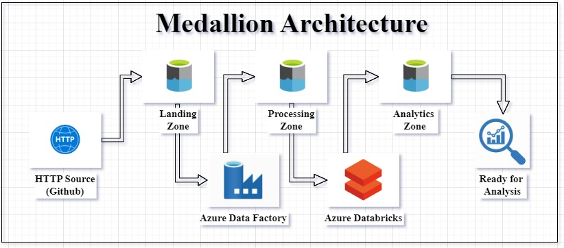

# Paris Olympics Data Pipeline

## Project Overview

** Paris Olympics Data Pipeline** is a scalable, automated ETL pipeline built using Microsoft Azure services. It demonstrates how to transform raw data into business-ready datasets through Azure Data Factory, Azure Databricks, and PySpark, following the Medallion Architecture. This project showcases modern data engineering practices for building robust pipelines, ensuring data quality, and automating data workflows.

## Key Features

- **Automated Data Pipeline**: End-to-end orchestration using Azure Data Factory.
- **Medallion Architecture**: Bronze (raw), Silver (cleaned), and Gold (business-ready) data layers.
- **Scalable Transformations**: PySpark in Databricks for efficient data processing.
- **ADF Dataflows**: Complex transformations implemented with Azure Data Factory's Dataflows.
- **Business-Ready Data**: Clean, enriched datasets ready for downstream consumption.

## Architecture

- **Bronze Layer**: Raw data ingestion.
- **Silver Layer**: Data cleaning and transformation.
- **Gold Layer**: Final, business-ready datasets.

## Project Structure

## Technologies Used

- **Azure Data Factory**: For pipeline automation and orchestration, including Dataflows.
- **Azure Databricks**: PySpark for scalable data transformation.
- **Azure Data Lake Storage Gen2**: Data storage across Bronze, Silver, and Gold layers.

## Setup Instructions

1. Clone the repository and upload CSV files from the `DataFiles` folder to ADLS Gen2.
2. Deploy resources using `azure_deployment.json`.
3. Import the ADF pipeline JSON and run the pipeline to process the data.

## Conclusion

This project exemplifies how to build a modern data pipeline on Azure using the Medallion Architecture, integrating automation and scalability at every step. Feel free to explore the repository, and reach out for feedback or collaboration.

